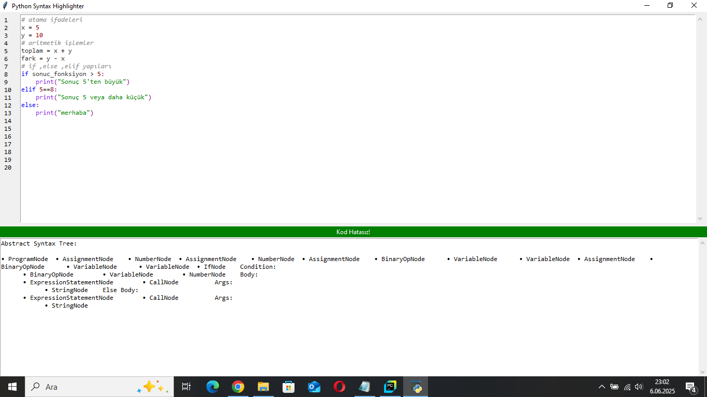
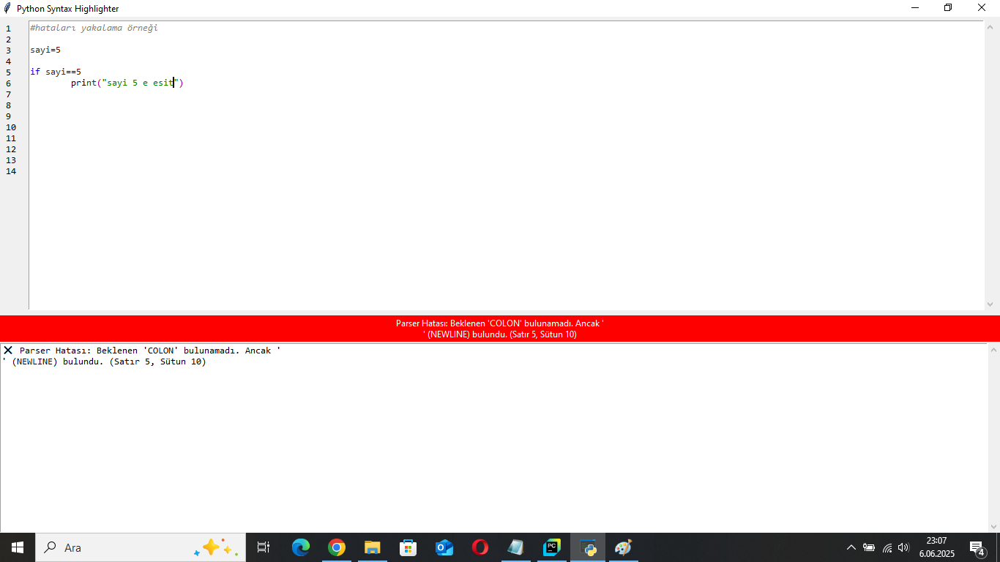

# Gerçek Zamanlı Sözdizimi Vurgulayıcı (Syntax Highlighter) – GUI Uygulaması

## 📌 Genel Bakış

Bu proje, bir **programlama dili** için gerçek zamanlı çalışan, **grafiksel kullanıcı arayüzü (GUI)** içeren bir **sözdizimi vurgulayıcı** uygulamasıdır. Geliştirilen sistem, **biçimsel dil kurallarına (gramer)** dayalı olarak **lexical ve sözdizimsel (syntax) analiz** gerçekleştirir.

Proje kapsamında hiçbir hazır vurgulama (highlighting) kütüphanesi kullanılmamış, tüm analiz araçları sıfırdan geliştirilmiştir.

## 🚀 Özellikler

- Tkinter tabanlı kullanıcı dostu grafik arayüzü
- Kod yazılırken gerçek zamanlı sözdizimi vurgulaması
- En az 5 farklı token türünü anlık olarak ayırt edip renklendirme
- Regex tabanlı programatik lexical analiz
- Recursive Descent (Top-Down) parser ile sözdizimsel analiz
- Hatalı sözdizimi kullanıcıya anlık olarak gösterme
- Kod bloklarını girintiye göre algılama ve ayrıştırma
- Harici herhangi bir sözdizimi vurgulama kütüphanesi kullanılmaz

## 🧩 Desteklenen Token Türleri

| Token Türü         | Açıklama                                                           |
|--------------------|--------------------------------------------------------------------|
| Anahtar Kelimeler  | `if`, `else`, `while`, `def`, `return`, `and`, `or`, `not` vb.    |
| Operatörler        | `=`, `==`, `+`, `-`, `*`, `/`, `%`, `!=`, `<`, `>`, `<=`, `>=` vb. |
| Sayılar            | Tam sayılar ve ondalıklı sayılar                                  |
| Dizeler (String)   | `'metin'`, `"metin"` gibi tırnak içindeki ifadeler                |
| Yorumlar           | `#` ile başlayan açıklama satırları                                |
| Tanımlayıcılar     | Değişken ve fonksiyon isimleri                                     |
| Boolean Değerleri  | `True`, `False`, `None` gibi yapılar                               |
| Fonksiyon Çağrıları| `print(x)` gibi fonksiyon kullanımları                            |
| Yapısal Semboller  | Parantezler `(` `)` , `:` , `,` gibi sözdizim sembolleri           |
| Kod Blokları       | Girintiye dayalı blok yapıları (if, while, def içeriği vb.)        |
| Hatalı Karakterler | Tanınmayan veya yanlış yazılmış semboller                         |

## 🎨 Vurgulama Renkleri

| Token Türü       | Renk          |
|------------------|---------------|
| Anahtar Kelime   | Mavi          |
| Tanımlayıcı      | Siyah         |
| Sayı             | Turuncu       |
| Operatör         | Kırmızı       |
| Sembol           | Gri           |
| Yorum            | Yeşil         |
| Dize             | Mor           |
| Boolean Değerleri| Koyu Mavi     |
| Hatalı Karakter  | Kırmızı (Altı Çizili) |

## 🖼 Görsel Örnekler

### Başarılı Kod Vurgulaması



---

### Hata Yakalama Örneği



---

## 🖼 Arayüz (GUI)

- Python Tkinter kullanılarak oluşturuldu
- Kullanıcı yazdıkça sözdizimi anında güncellenir ve renklendirilir
- Hatalı sözdiziminde görsel uyarı
- (Opsiyonel) AST yapısını görselleştirme desteği

## 📄 Dokümantasyon

Bu proje kapsamında geliştirme süreci, teknik detaylar, dosya yapısı ve analiz mantığıyla ilgili tüm bilgiler aşağıdaki Medium makalesinde ayrıntılı şekilde açıklanmıştır:

🔗 [Gerçek Zamanlı Sözdizimi Vurgulayıcı Projesi: Tasarım ve Uygulama](https://medium.com/@elif.bycn35/ger%C3%A7ek-zamanl%C4%B1-s%C3%B6zdizimi-vurgulay%C4%B1c%C4%B1-projesi-tasar%C4%B1m-ve-uygulama-ccd0be769c66)

### İçerik

- Dil ve gramer seçimi
- Lexical analiz süreci ve yöntemleri
- Parser yapısı ve kuralları
- Sözdizimi vurgulama mantığı
- GUI tasarımı ve işleyişi

## 📹 Tanıtım Videosu

Uygulamanın nasıl çalıştığını gösteren tanıtım videosuna aşağıdan ulaşabilirsiniz:

▶️ [Tanıtım Videosu](https://youtu.be/ICM6kak8eOc)

## 📦 Kurulum ve Kullanım

```bash
# Projeyi klonlayın
git clone https://github.com/elifnurbeycanz/PythonSyntaxHighlighter.git
cd PythonSyntaxHighlighter

# Uygulamayı başlatın
python main.py
